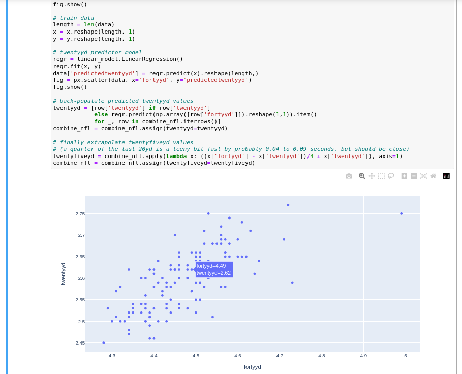

# NBA and NFL Combine Performance Percentiles

A quick notebook exploring the comparitive jumping and sprinting percentiles between NBA and NFL combine performances.

## Takeaways

- **A 40 inch vertical1 in these NBA combine data2 corresponds to the 90th percentile of vert measurements.**
- **The corresponding standing vertical in these NFL combine data3 is 38.5 inches4.**
- **The corresponding 40 yard dash in these NFL combine data is 4.4 seconds.5.**

1. The NBA combine limits "max vertical" to a 15 foot approach. 
2. This only includes attendees that elected to test their vertical (generally the very top prospects have no need to participate in the athletic tests).
3. Again, only of attendees that elected to participate in the combine (some top prospects have no need to participate). Additionally, this comparison does not include linemen, as they train for very different physical characteristics than speed and vertical.
4. Some trainers suspect "shoulder packing" (retracting the scapula during standing reach measurement) is more common in the NFL combine than the NBA combine, which would inflate the standing vertical measurements in the NFL. This occurs because standing reach is a useful metric in basketball but unimportant in football, so at the NFL combine attendees would have much less incentive to reach as high as they can.
5. The NFL combine uses hand timing for the start, but laser gates for the finish.

---

## For more exporation, [browse a summary of the plots](./plots.md), or [view the whole process in `combine.ipynb`](./combine.ipynb)

