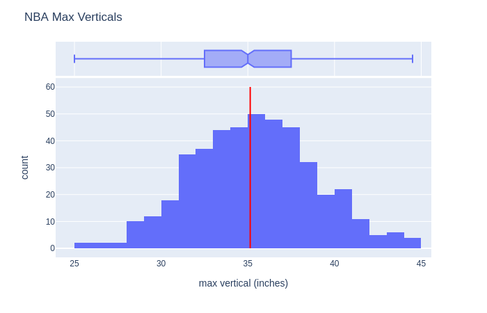
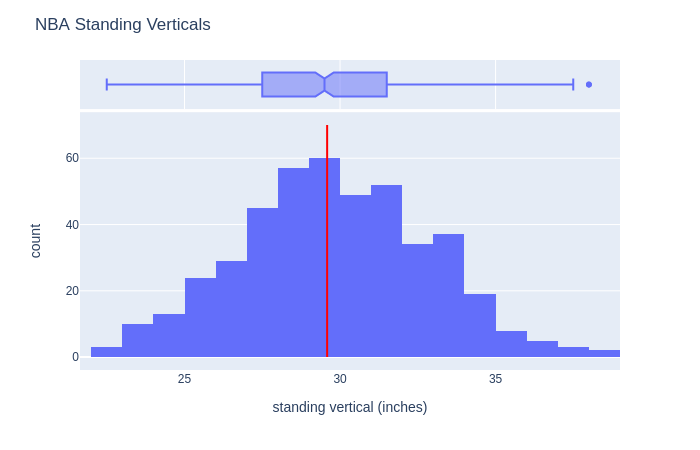
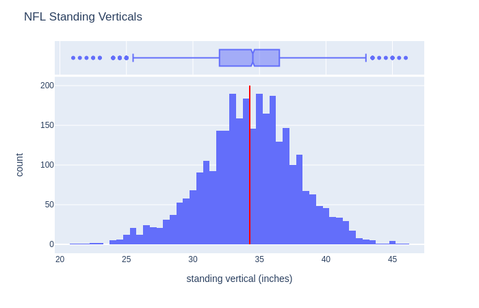
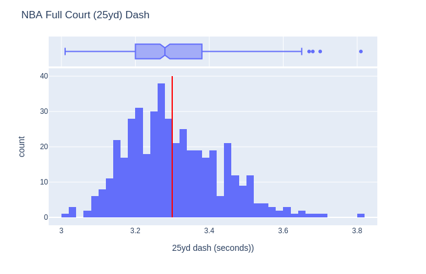
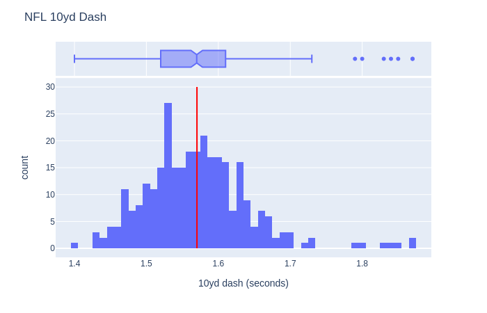
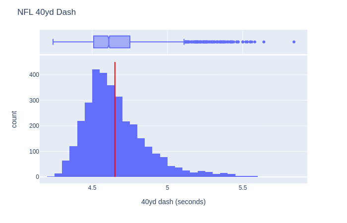

All the NFL data is disregarding lineman.

Obviously a better method would be to normalize the data in some way according to height and weight, but I just wanted to take a quick look.

A 40" vertical is the
89.33'th percentile
(of NBA combine attendees who elected to test max vertical)

Corresponding to the percentile of an NBA 40" max vertical
The standing vertical at the 89.33th percentile of NFL combine attendees is
38.5"

Corresponding to the percentile of an NBA 40" max vertical
The forty yard time at the 89.33th percentile of NFL combine attendees is
4.4 seconds
